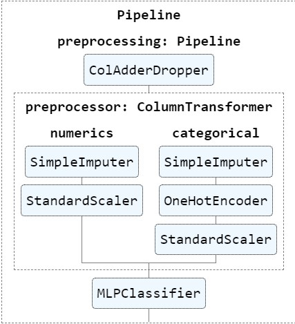
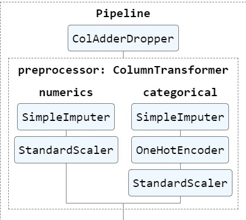

<!-- PROJECT LOGO -->
 

  

<h3 align="center">DATA PREPROCESSING AND MODELING</h3>

  

    Preprocessing and modeling to predict for heart disease data.
  

<!-- TABLE OF CONTENTS -->

  
Table of Contents

  <ol>
    <li>
      <a href="#about-the-project">About The Project</a>
      <ul>
        <li><a href="#data-preprocessing">Data Preprocessing</a></li>
        <li><a href="#classifier">Classifier</a></li>
        <li><a href="#built-with">Built With</a></li>
      </ul>
    </li>
    <li>
      <a href="#usage">Usage</a>
    </li>
    <li><a href="#citation">Citation</a></li>
    <li><a href="#contact">Contact</a></li>
  </ol>

<!-- ABOUT THE PROJECT -->
## About The Project
This project is going to build a pipeline for the problem of predicting the presence of heart disease in the patient.

  

My pipeline contains two phases:
* Preprocessing
* MLP Classifier

### Data Preprocessing
Create a `preprocessing_pipeline` for this process.

### Setup phase:
Firstly, explore the dataset:
* Information about the dataset

  * The number of `null` and `non-null` in each column and its type.

* Shape of the dataset
* The meaning of each row
* Does the dataset contain duplicate data?
* Read file description in `data\description.txt`

Secondly, define the problem to be solved.

Thirdly, before splitting the dataset into the training set and the validation set, we must explore the final column (output):
* Type of output column.
  Does it match the required type for the particular classification algorithm?
* Does the output column miss some value?
* The ratio of each class (balance / imbalance).
  => Find the appropriate classification algorithm.

### Preprocessing phase:
Firstly, split the dataset into the training set and the validation set.

Secondly, preprocess training set:
* Create a class `ColAdderDropper` extending from 2 classes of `Sklearn`: `BaseEstimator` and `TransformerMixin`

  * Create a new `cp_reduced` from the original `cp` column (preserving `num_top_cp_values`, others is assigned as `-1` ). Because the `cp` column contains many values => easy to overfitting when using `one-hot-encoding`.
  * Fill the missing data:
  
    * Mean for numerical values.
    * Mode for categorical values then converting to numerical by using `OneHotEncoder in Sklearn`.
  * Normalize data using `StandardScaler in Sklearn`.

  

* Preprocess training set using `fit_transform` method.
* Preprocess validation set using `transform` method only.

### Final phase:
Merge 2 phases into 1 final pipeline `full_pipeline`.

### Classifier
I use the `MLPClassifier in Sklearn` to predict heart disease.
To find the best configuration of this classifier, we have two ways:
* Try each parameter in turn until you find the best model which has the best validation accuracy.
* Use `GridSearch CV in Sklearn` to automatically find the best parameters.

(<a href="#top">back to top</a>)

### Built With

* [Python](https://www.python.org/)
* [Scikit-learn](https://scikit-learn.org/stable/)
* [Seaborn](https://seaborn.pydata.org/)
* [Matplotlib](https://matplotlib.org/)
* [NumPy](https://numpy.org/)
* [Pandas](https://pandas.pydata.org/)
* [Jupyter](https://jupyter.org/)

(<a href="#top">back to top</a>)

<!-- USAGE -->
## Usage

The notebook is constructed in readable way containing detailed description at each phase.

You can find the source code in: 
[Link](https://github.com/nguyendothanhtruc/data-preprocessing-and-modeling/tree/main/code)

(<a href="#top">back to top</a>)

<!-- CITATION -->
## Citation

If you found this project helpful, please consider citing me.

(<a href="#top">back to top</a>)

<!-- CONTACT -->
## Contact

Nguyễn Đỗ Thanh Trúc - [Facebook](https://www.facebook.com/NDTT0256) - [Linkedin](https://www.linkedin.com/in/ndttruc/) -  ndttruc2506@gmail.com

Project Link: [https://github.com/nguyendothanhtruc/data-preprocessing-and-modeling](https://github.com/nguyendothanhtruc/data-preprocessing-and-modeling)

(<a href="#top">back to top</a>)

